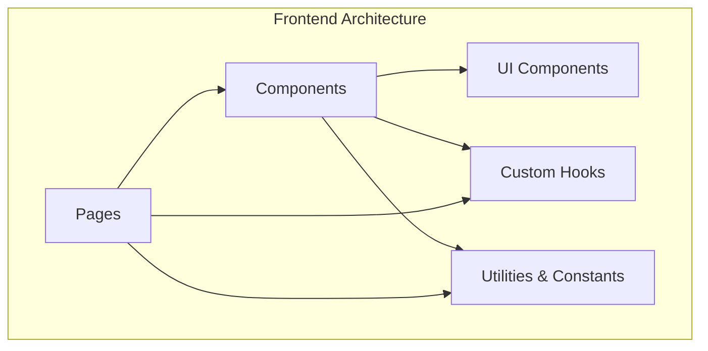
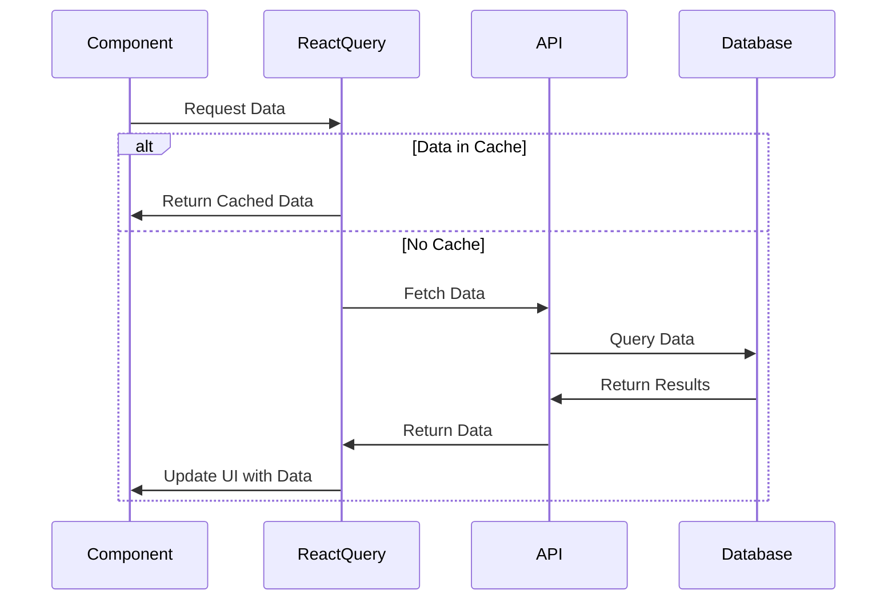
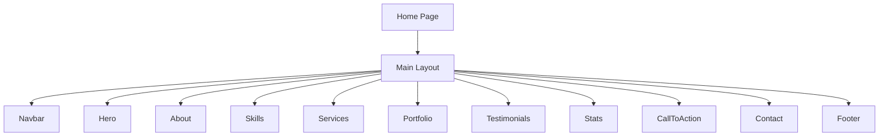

# LLM.README.md for ratiogamo/portfolio

## Project Overview

This repository contains a full-stack TypeScript portfolio website with a React frontend and Express backend. The project uses modern web technologies including React, Tailwind CSS, shadcn/ui components, React Query for data fetching, and Drizzle ORM with NeonDB for database operations.

## Repository Structure

```
ratiogamo/portfolio/
├── attached_assets/     # Project assets
├── client/             # Frontend React application
│   ├── index.html
│   └── src/
│       ├── components/ # React components
│       │   └── ui/     # UI component library (shadcn/ui)
│       ├── hooks/      # Custom React hooks
│       ├── lib/        # Utility functions and constants
│       ├── pages/      # Page components
│       ├── App.tsx     # Main application component
│       ├── index.css   # Global styles and Tailwind imports
│       └── main.tsx    # Application entry point
├── server/             # Backend Express server
├── shared/             # Shared code between client and server
├── .gitignore
├── .replit             # Replit configuration
├── components.json     # shadcn/ui component configuration
├── drizzle.config.ts   # Drizzle ORM configuration
├── package.json        # Project dependencies and scripts
├── postcss.config.js   # PostCSS configuration
├── tailwind.config.ts  # Tailwind CSS configuration
├── tsconfig.json       # TypeScript configuration
└── vite.config.ts      # Vite bundler configuration
```

## Key Technologies

### Frontend
- **React**: UI library
- **TypeScript**: Type-safe JavaScript
- **Tailwind CSS**: Utility-first CSS framework
- **shadcn/ui**: Component library based on Radix UI
- **React Query**: Data fetching and caching
- **Wouter**: Lightweight routing
- **React Hook Form**: Form handling with Zod validation

### Backend
- **Express.js**: Node.js web framework
- **Drizzle ORM**: TypeScript ORM
- **NeonDB**: Serverless Postgres database
- **Passport.js**: Authentication middleware

## Architecture Patterns

### Frontend Architecture

The frontend follows a component-based architecture with:

1. **Pages**: Top-level route components
2. **Components**: Reusable UI sections
   - Section components (Hero, About, Portfolio, etc.)
   - UI components (buttons, cards, dialogs, etc.)
3. **Hooks**: Custom React hooks for shared logic
4. **Lib**: Utility functions and constants



### Data Flow

The application uses React Query for data fetching and state management:



### Backend Architecture

The backend follows a typical Express.js architecture with:

1. **API Routes**: Endpoint definitions
2. **Controllers**: Business logic
3. **Models**: Data access via Drizzle ORM
4. **Middleware**: Authentication and request processing

## Component Structure

### Page Structure

The main page structure follows this hierarchy:



### Key Components

1. **Hero.tsx**: Portfolio hero section with profile information
   - Displays professional stats, availability, and call-to-action
   - Uses React Query to fetch profile data
   - Implements responsive design with mobile/desktop layouts

2. **Portfolio.tsx**: Project showcase with filtering
   - Displays projects with filtering by category
   - Uses React Query for data fetching
   - Implements responsive grid layout

3. **Navbar.tsx**: Navigation component
   - Responsive design with mobile/desktop views
   - Navigation links to page sections

## Design System

### Theme Configuration

The project uses CSS variables for theming with light and dark mode support:

- **Color System**: Based around blues and purples
- **Typography**: Needs more structured hierarchy
- **Spacing**: Currently inconsistent, could benefit from a defined scale
- **Components**: Using shadcn/ui with the "new-york" style variant

### UI Component Library

The project uses shadcn/ui components, which are built on top of Radix UI primitives. These components are located in `client/src/components/ui/` and include:

- Buttons, cards, dialogs
- Forms, inputs, selects
- Tabs, accordions, carousels
- And many more UI primitives

## Common Patterns and Conventions

### Data Fetching

```typescript
// Example pattern for data fetching with React Query
const { data, isLoading, error } = useQuery({
  queryKey: ['resourceName'],
  queryFn: fetchResourceFunction
});

// Handle loading state
if (isLoading) return <LoadingSkeleton />;

// Handle error state
if (error) return <ErrorDisplay error={error} />;

// Render data
return <DataDisplay data={data} />;
```

### Component Structure

```typescript
// Example component structure pattern
import React from 'react';
import { useQuery } from '@tanstack/react-query';
import { SomeComponent } from '@/components/ui/some-component';

// Define types
interface DataType {
  // properties
}

// Component definition
export function ExampleComponent() {
  // Hooks
  const isMobile = useMobile();
  
  // Data fetching
  const { data } = useQuery({...});
  
  // Event handlers
  const handleAction = () => {
    // logic
  };
  
  // Render
  return (
    <section className="container mx-auto py-12">
      {/* Component JSX */}
    </section>
  );
}
```

## Important Files to Reference

When working with this codebase, these files provide critical context:

1. **client/src/App.tsx**: Main application structure and routing
2. **client/src/index.css**: Global styles and CSS variables
3. **client/src/components/MainLayout.tsx**: Overall page layout
4. **tailwind.config.ts**: Design system configuration
5. **components.json**: UI component configuration
6. **package.json**: Project dependencies and scripts

## UI/UX Considerations

The current UI/UX has these characteristics:

1. **Visual Style**: Modern with gradients, animations, and hover effects
2. **Responsiveness**: Adapts to mobile and desktop viewports
3. **Theming**: Supports light and dark modes
4. **Animations**: Custom animations for visual interest

Areas identified for UI/UX improvement:
- More consistent typography and spacing
- Enhanced accessibility
- Performance optimization
- Improved mobile experience
- More sophisticated loading patterns

## Working with This Codebase

When making changes to this codebase:

1. **Component Modifications**: Follow existing patterns for component structure
2. **Styling**: Use Tailwind CSS utilities and extend the theme in tailwind.config.ts
3. **New Features**: Add new components in the appropriate directories
4. **Data Fetching**: Use React Query patterns for consistency

## Development Workflow

The project uses npm scripts for development:

- `npm run dev`: Start development server
- `npm run build`: Build for production
- `npm run start`: Start production server

## Conclusion

This portfolio project is a modern, full-stack TypeScript application with a component-based architecture. It uses React, Tailwind CSS, and shadcn/ui for the frontend, with Express and Drizzle ORM for the backend. The codebase is well-structured but has opportunities for UI/UX improvements in consistency, accessibility, and performance.